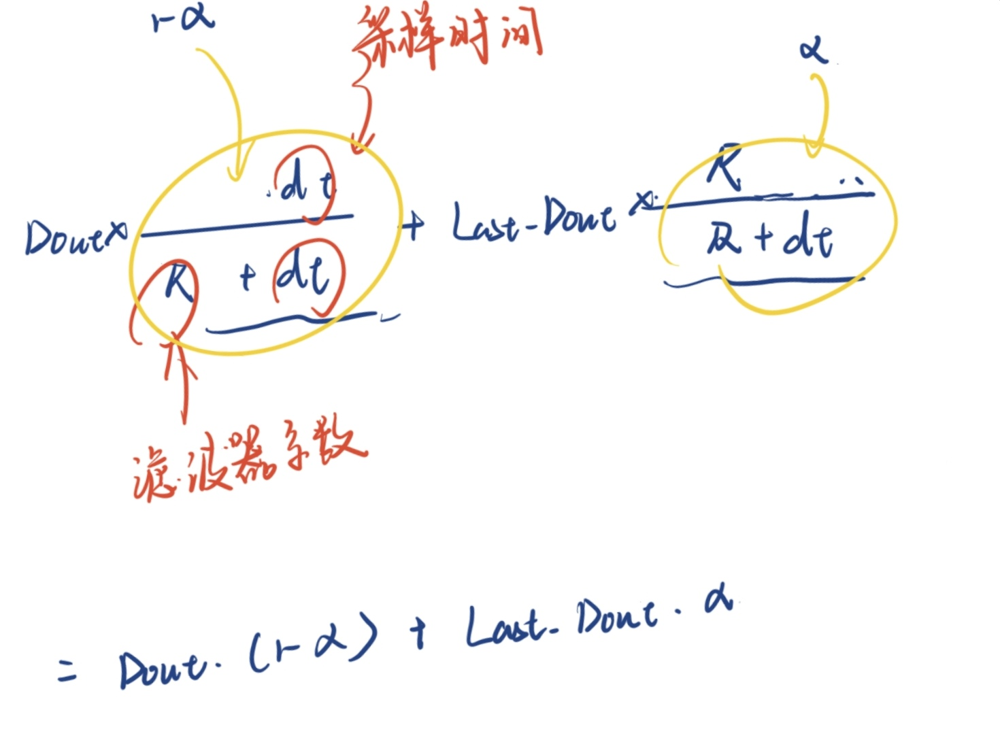

写在开头，在这里贴一篇很棒的文章，很详细地讲解了各种pid优化选项
https://zhuanlan.zhihu.com/p/468741326
根据文章所述，pid控制算法可以分为两类：专家pid 和 模糊pid
专家pid 就是下面所要说的pid控制器优化选项

2024年10月29日写：一则调参经验，速度环不建议加死区，会导致output = 0 造成电机转动卡顿，位置环需加死区，加快收敛
# pid控制器优化选项
- 何为“专家”，因为这些优化选项本质上是使用传统pid时所会遇到的问题，而“专家”则代表着“经验”
- 下面是pid_controller中所提供的一些优化选项
```c
typedef enum pid_Improvement_e
{
    NONE = 0X00,                        //0000 0000 不使用任何优化环节
    Integral_Limit = 0x01,              //0000 0001 使用积分限幅
    Derivative_On_Measurement = 0x02,   //0000 0010 微分先行
    Trapezoid_Intergral = 0x04,         //0000 0100 使用梯形积分
    Proportional_On_Measurement = 0x08, //0000 1000 比例先行
    OutputFilter = 0x10,                //0001 0000 输出滤波（LR）
    ChangingIntegrationRate = 0x20,     //0010 0000 变速积分
    DerivativeFilter = 0x40,            //0100 0000 微分滤波（LR）
    ErrorHandle = 0x80,                 //1000 0000 错误处理（电机堵转）
} PID_Improvement_e;
```


## 变速积分（和积分分离解决同一个问题）
- 解决什么问题？
超调项实在没办法通过调节p来解决了，使用这个选项（或许）可以解决问题

思想：在积分成累加趋势时，根据误差的大小来做
- 通过调节这两个选项进行调节：
```c
// 变速积分参数
// coefficient of changing integration rate
pid->CoefA = A;
pid->CoefB = B;
```
设置CoefA 和 CoefB 就是设置两个阈值，注意设置大小的顺序：
代码中是这样写的：
```c
static void f_Changing_Integration_Rate(PID_t *pid)
{
    if (pid->Err * pid->Iout > 0)
    {
        // still integral
        if (abs(pid->Err) <= pid->CoefB)
            return; // when err <= CoefB , Full integral 
        if (abs(pid->Err) <= (pid->CoefA + pid->CoefB))
            pid->ITerm *= (pid->CoefA - abs(pid->Err) + pid->CoefB) / pid->CoefA;// when CoefB < err <= CoefA + CoefB , change the speed of integral
        else
            pid->ITerm = 0;// when err ? CoefA + CoefB , stop integral 
    }
}
```


## 梯形积分


## 积分限幅 + 抗积分饱和
```c
static void f_Integral_Limit(PID_t *pid)
{
    static float temp_Output, temp_Iout;// 存储临时输出和积分项
    temp_Iout = pid->Iout + pid->ITerm;
    temp_Output = pid->Pout + pid->Iout + pid->Dout;
    // 抗积分饱和
    if (abs(temp_Output) > pid->MaxOut)
    {
        if (pid->Err * pid->Iout > 0)
        {
            // 积分呈累积趋势
            pid->ITerm = 0;
        }
    }
    // 积分限幅
    if (temp_Iout > pid->IntegralLimit)
    {
        pid->ITerm = 0;
        pid->Iout = pid->IntegralLimit;
    }
    if (temp_Iout < -pid->IntegralLimit)
    {
        pid->ITerm = 0;
        pid->Iout = -pid->IntegralLimit;
    }
}
```
建议查看你使用的pid控制器中iout的变化来设置IntegralLimit


## 微分先行
- 解决什么问题？
减少噪声影响：对测量值进行微分可以减少噪声对微分控制的影响，因为测量值通常比误差更平滑。
提高响应速度：微分先行可以提高系统的响应速度，因为它直接对测量值的变化进行反应，而不是等待误差变化。
- 微分先行的思想
```c
pid->Dout = pid->Kd * (pid->Err - pid->Last_Err) / pid->dt;
```


## 不完全微分

说人话：就是给微分输出加以低通滤波器，滤除高频噪声
```c
// 对微分输出部分进行低通滤波
static void f_Derivative_Filter(PID_t *pid)
{
    pid->Dout = pid->Dout * pid->dt / (pid->Derivative_LPF_RC + pid->dt) +
                pid->Last_Dout * pid->Derivative_LPF_RC / (pid->Derivative_LPF_RC + pid->dt);
}
```
调节指导：pid->Derivative_LPF_RC 较大时，滤波器响应较慢，输出更平滑
                                较小时，可能会引入更多噪声
        注意：dt是你使用pid控制器的时间周期，对于电机来说是0.001左右（由dwt计算得到的实际控制周期时间）
        看图：代码展开为公式是

你调整这个Derivative_LPF_RC实际上是调a


## 输出滤波
- 同前面对微分输出做的低通滤波器一样，代码转化为公式：


# 模糊pid 学习
- 模糊算法：逐次求精的过程
> 我们设计一个倒立摆系统，假如摆针偏差＜5°，我们说它的偏差比较“小”；摆针偏差在5°和10°之间，我们说它的偏差处于“中”的状态；当摆针偏差＞10°的时候，我们说它的偏差有点儿“大”了。对于“小”、“中”、“大”这样的词汇来讲，他们是精确的表述，可问题是如果摆针偏差是3°呢，那么这是一种什么样的状态呢。我们可以用“很小”来表述它。如果是7°呢，可以说它是“中”偏“小”。那么如果到了80°呢，它的偏差可以说“非常大”。而我们调节的过程实际上就是让系统的偏差由非常“大”逐渐向非常“小”过度的过程。当然，我们系统这个调节过程是快速稳定的。通过上面的说明，可以认识到，其实对于每一种状态都可以划分到大、中、小三个状态当中去，只不过他们隶属的程度不太一样，比如6°隶属于小的程度可能是0.3，隶属于中的程度是0.7，隶属于大的程度是0。这里实际上是有一个问题的，就是这个隶属的程度怎么确定？
- 设计隶属函数
