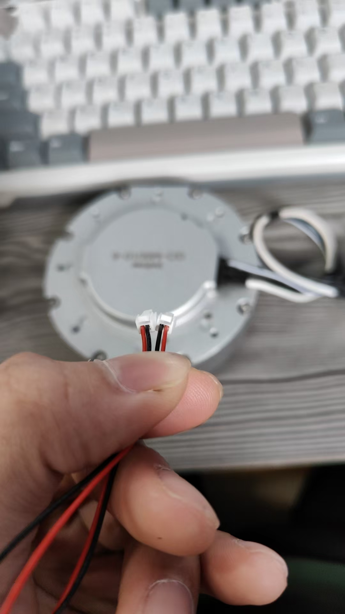

<<<<<<< HEAD
# 硬件要求
- 使用反can，即和达妙电机一致的can线，记得检查，不然会跟笔者一样坐牢一天


# GO1电机实例化
```c++
#ifdef DEBUG_GO1_MOTOR

CAN_Rx_Instance_t go1_rx_instance = {
    .can_handle = &hcan2,
    .RxHeader = {0},
    .rx_len = 8,
    .can_rx_buff = {0},
};

CAN_Tx_Instance_t go1_tx_instance = {
    .can_handle = &hcan2,
    .isExTid = 0,
    .tx_mailbox = 0,
    .tx_len = 8,
    .can_tx_buff = {0},
};

Motor_Control_Setting_t go1_motor_ctrl = {0};
// 较为特殊的go1电机，有些选项不需要配置！
GO_M8010 go1_motor[1]={GO_M8010(1,go1_rx_instance,go1_tx_instance,go1_motor_ctrl,0,-1,CAN_To_RS485_Module_ID_1,GO1_Motor_ID_1)};

#endif
```
如上所见：
can通信配置使用扩展帧，go1电机的can通信id是29位扩展帧id，所以需要配置isExTid = 1
go1电机内置FOC闭环，所以不需要进行配置Motor_Control_Setting_t项，直接置{0}即可
而且go1电机的can通信用id随发送模式变化，所以不需要配置初始化的can id （接收id也是
（这是比较抽象的一点，go1电机的rx_id 为29位扩展帧id，但实际上作为标识符的只有前两位，id的后27位甚至是数据帧，所以解析数据时还需要对这部分id进行处理
对比大疆电机，需要额外配置 module id，即can转485模块的id，这个可以通过模块上的拨码开关进行配置，出厂配置是3，并且can波特率是1M
然后是ID，这个严格就是电机id，需要通过上位机进行查询，笔者的go1电机id是0

# 提供go1 的api
=======
# 硬件要求
- 使用正can，即和大疆电机一致的can线
>>>>>>> ed5a7bc63a58a0dc3d0b3d2590c344075653ba47
