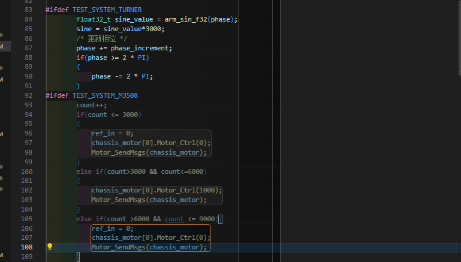

# 通用框架探索
- 更加强大的调试工具ozone、segger rtt、segger_systemview的移植已经加入框架
- 更加清晰的程序分层架构，app层和驱动层较好的解耦
- pub-sub机制，线程之间的通信，消灭滥用的全局变量

# ToolChain 
- 完整形态可以支持三种项目构建方式：基于Keil 的项目构建方式、 Makefile的项目构建方式、CMake的项目构建方式
    - 使用Keil5，做好c/c++混编的前置操作和头文件路径设置，即可快速上手
    - 推荐方式：Makefile & CMake 
    对项目构建的过程能有更加清晰的认知，在报错中逐渐了解编译器的某些特性（doge
    而且CMake 和 Makefile 使用 更加快速、现代的工具链 arm-none-eabi-gcc / g++，更加快速，可以根据实际计算机性能调用多核编译（相比之下Keil的arm-cc单核编译就显得垃圾了）
- CMakeLists.txt 和 Makefile 两者：目前c_cpp 的插件仅支持CMake tools直接识别CMakeLists.txt 然后对你的vscode提供更多的可视化操作
    ege：如果使用宏定义开关，那么如果c_cpp插件识别到你的宏定义，那么在那些没有开启的宏开关部分，就会用浅色的色调来显示，更加便于其他用户进行开发，而且vscode对于插件的操作是很符合程序猿思维的，只要你动手去自己修改几个setting.json之后就会懂得其他应该怎么设置了
    
- 目前完成进度：
    1. CMakeList.txt 比较容易操作，而且开发后需要修改的部分比较少（不用说添加新的源文件就得修改，现在的模板可以直接在路径中去搜索已存在的源文件），并且支持c_cpp插件，且可以搭配ninja实现更加快速地编译；根目录下的CMakeLists.txt是适配于本工程的，可以看着改（结合gpt不难
    已经默认开启了c/cpp混编（c采用gcc，c++使用g++）和fpu单精度浮点运算，链接了arm_math 高速数学运算DSP库
    2. Makefile 需要做频繁的添加文件路径操作，但是现在也是模板的性质了，只在需要添加新的源文件时或头文件去指定路径就可以了；优点是你可以对还不能正常编译的文件取消路径的指定，这样编译器就会直接放弃那个文件的构建，但对应带来的坏处也就是你可能会忘... 
    3. Keil方面，待有缘人帮我搞...
 (都带有大量注释，结合gpt和注释看懂是不难的，主要看有没有心罢了)

# vscode配置文件设置
- 可以直接抄.vscode 目录下的东西，也是看着修改，没啥好说的
- 使用CMake tools 时，默认的构建方式是MinGW Makefiles，而我的工程使用的是cmake + ninja 构建，所以在使用过ninja构建过后，使用CMake tools 配置时，会报错：
这只需要在这里修改一下就可以

- c_cpp_properties.json
（笔者在好长一段时间内使用vscode开发没有任何代码提示、错误提醒时居然没有一点怀疑）
只需要看着抄就可以了（可视化包括代码提示、错误提醒、代码补全等等）
```json
        {
            "name": "arm-cmsis-c/cpp_use_cmake",// c_cpp插件会结合CMakeLists.txt的内容来给你提供可视化和代码提醒
            "includePath": [
                "${workspaceFolder}/**"
            ],
            "defines": [
                "_DEBUG",
                "UNICODE",
                "_UNICODE",
                "USE_HAL_DRIVER",
                "STM32F407xx",
                "ARM_MATH_CM4",
                "ARM_MATH_MATRIX_CHECK",
                "ARM_MATH_ROUNDING",
                "ARM_MATH_LOOPUNROLL",
                "DISABLEFLOAT16"
            ],
            "cStandard": "c17",
            "cppStandard": "c++17",
            "intelliSenseMode": "windows-gcc-arm",
            "configurationProvider": "ms-vscode.cmake-tools"// 核心：在这里和cmake tools联动，但是注意cmake tools 要先能成功识别你的CMakeLists.txt，这些可以自己找找教程，不难
        },
        {
            "name": "arm-cmsis-c/cpp_use_makefile",// c_cpp插件会结合Makefile的内容来给你提供可视化和代码提醒
            "includePath": [
                "${workspaceFolder}/**"
            ],
            "defines": [
                "_DEBUG",
                "UNICODE",
                "_UNICODE",
                "USE_HAL_DRIVER",
                "STM32F407xx",
                "ARM_MATH_CM4",
                "ARM_MATH_MATRIX_CHECK",
                "ARM_MATH_ROUNDING",
                "ARM_MATH_LOOPUNROLL",
                "DISABLEFLOAT16",
                "USE_RTOS_FOR_UART",
                "TOPICS_DEBUG",
                "DEBUG_FOR_ACTION",
                "CHASSIS_TO_DEBUG",
                "TEST_SYSTEM_TURNER",
                "TEST_SYSTEM_M2006",
                "TEST_SYSTEM_GM6020",
                "DISABLE_LOG_SYSTEM",
                "TEST_SYSTEM_M3508",
                "DISABLE_SYSVIEW_SYSTEM"
            ],
            "cStandard": "c17",
            "cppStandard": "c++17",
            "intelliSenseMode": "windows-gcc-arm",
            "configurationProvider": "ms-vscode.cmake-tools"
        }
```
- launch.json 
直接抄，配置完就可以实现vscode直接烧录、调试（不推荐使用vscode调试，还是使用ozone
```json
{
    // 启动调试的快捷键是F5
    "version": "0.2.0",
    "configurations": [
        // 使用dap-link(如无线调试器时的参考配置)
        {
            "name": "DAPlink",
            "cwd": "${workspaceRoot}",
            "executable": "${workspaceRoot}\\build\\new_build.elf", // 要下载到调试器的文件,花括号中的是vscode两个预定义的参数
            "request": "launch",
            "type": "cortex-debug",
            //使用J-link GDB Server时必须;其他GBD Server时可选（有可能帮助自动选择SVD文件）
            //支持的设备见 https://www.segger.com/downloads/supported-devices.php
            "device": "STM32F407ZG",
            //svd文件，有这个文件才能查看寄存器的值，每个单片机都不同。可以在以下地址找到 https://github.com/posborne/cmsis-svd
            //该项目的根目录已经提供了C型开发板使用的外设svd文件
            "svdFile": "STM32F407.svd",
            "servertype": "openocd", //使用的GDB Server
            "configFiles": [
                "openocd_dap.cfg", // 配置文件已经在根目录提供,若要修改以此类推,openocd的路径下的share/scripts中有各种写好的配置文件
            ],
            "runToEntryPoint": "main", // 调试时在main函数入口停下
            "showDevDebugOutput": "none", // 查看详细的调试输出
            "rtos": "FreeRTOS",
            "preLaunchTask": "build task",//先运行Build任务编译项目,取消注释即可使用
            "liveWatch": {
                "enabled": true,
                "samplesPerSecond": 4
            }
            // dap若要使用log,请使用Jlink调试任务启动,之后再打开log任务
            // 若想要在调试前编译并且打开log,可只使用log的prelaunch task并为log任务添加depends on依赖
        },
        // 使用j-link进行调试时的参考配置
        {
            "name": "Jlink",
            "cwd": "${workspaceFolder}",
            "executable": "${workspaceRoot}\\build\\new_build.elf",
            "request": "launch",
            "type": "cortex-debug",
            "device": "STM32F407ZG",
            "runToEntryPoint": "main",
            "showDevDebugOutput": "none",
            "servertype": "jlink",
            "interface": "swd",
            "svdFile": "STM32F407.svd",
            "rtos": "FreeRTOS",
            "preLaunchTask": "build task",//先运行Build任务,取消注释即可使用
            "liveWatch": {
                "enabled": true,
                "samplesPerSecond": 4
            },
            // "preLaunchTask": "log", // 调试时同时开启RTT viewer窗口,若daplink使用jlinkGDBserver启动,需要先开始调试再打开log
            // 若想要在调试前编译并且打开log,可只使用log的prelaunch task并为log任务添加depends on依赖
        },
        {
            "name": "DAP-attach",
            "cwd": "${workspaceRoot}",
            "executable": "${workspaceRoot}\\build\\new_build.elf", // 要下载到调试器的文件,花括号中的是vscode两个预定义的参数
            "request": "attach",
            "type": "cortex-debug",
            "device": "STM32F407ZG",
            "svdFile": "STM32F407.svd",
            "servertype": "openocd",
            "configFiles": [
                "openocd_dap.cfg",
            ],
        },
        {
            "name": "Jlink-attach",
            "cwd": "${workspaceFolder}",
            "executable": "${workspaceRoot}\\build\\new_build.elf",
            "request": "attach",
            "type": "cortex-debug",
            "device": "STM32F407ZG",
            "showDevDebugOutput": "none",
            "servertype": "jlink",
            "interface": "swd",
            "svdFile": "STM32F407.svd",
            "rtos": "FreeRTOS",
        },
    ],
}

```
- tasks.json
这个配置文件是配置一些操作：即将你本来需要在终端中输入的一段段复杂的指令简化成一个个task，然后只要鼠标一点，就可以直接完成一系列操作：
```json
{
    // See https://go.microsoft.com/fwlink/?LinkId=733558
    "version": "2.0.0",
    "tasks": [
        {
            "label": "build task",         // 任务标签
            "type": "shell",               // 任务类型,因为要调用mingw32-make,是在终端(CMD)里运行的,所以是shell任务
            "command": "mingw32-make -C ToolChain -j16",// 任务命令,线程数可以根据自己的电脑修改,建议与cpu核数相同，一般来说，建议将并行任务数设置为不超过逻辑处理器数的 1.5 倍到 2 倍
            "problemMatcher": [],        
            "group": {
                "kind": "build",
                "isDefault": true
            },
            "dependsOn": ["clean"] // 添加依赖项，每次构建都必须删除原build目录下的东西 
        },
        {
            /* 从dap调试器下载 */
            "label": "download dap",
            "type": "shell",
            /* 设定为在下载前编译 */
            "command":"mingw32-make -C ToolChain -j16 ; mingw32-make -C ToolChain download_dap", // "mingw32-make -j24 ; mingw32-make download_dap",
            /* 如果没有修改代码，编译任务不会消耗时间 */

            /* group字段
                用于将任务分组，并指定任务的类型和默认形态
                kind:"build" :将任务分组为测试任务
                isDefault:true :将任务设置为默认任务
             */
            "group": {
                "kind": "build",
                "isDefault": true
            },
            "problemMatcher": []
        },
        {
            /* 从jlink调试器下载 */
            "label": "download jlink", // 要使用此任务,需添加jlink的环境变量
            "type": "shell",
            "command":"mingw32-make -C ToolChain -j16 ; mingw32-make -C ToolChain download_jlink", // "mingw32-make -j24 ; mingw32-make download_jlink"
            "group": {
                "kind": "build",
                "isDefault": true,
            }
        },
        {
            /* 打开日志调试终端任务 */
            "label": "log",
            "type": "shell",
            /* 打开RTT终端命令 */
            "command":"JlinkRTTClient",
            "args": [],
            "problemMatcher": [],
            // 若使用daplink,则将log任务设置为依赖于jlink launch任务,保证jlink launch任务先于log任务执行
        },
        {
            /* 清除build目录下生成的可执行文件 */
            "label": "clean",
            "type": "shell",
            /* 使用MSYS2下bash终端，因为其支持Linux下的所有命令 */
            "command": "workspace_path=$(cygpath \"${workspaceFolder}\") && cd \"$workspace_path/build\" && rm -rf ./*",
            /* 添加options项，区分默认使用powershell终端，这样就可以直接打开MSYS2下的bash终端 */
            "options": {
                "shell": {
                    /* 添加你自己的MSYS2 bash终端安装路径，记得需要添加到环境变量中 */
                    "executable": "C:\\msys64\\usr\\bin\\bash.exe",
                    /* 传递给Bash的参数 -l：使 Bash 作为登录 shell 启动 -c:传递命令字符串给 Bash 执行 */
                    "args": ["-l", "-c"]
                }
            }
        },
        {
            /* 使用cmake构建项目，编译生成可执行文件 */
            "label": "build_by_cmake",
            "type": "shell",
            "command": "cd build ; cmake -G \"Ninja\" .. ; ninja",
            "dependsOn": ["clean"] // 添加依赖项，每次构建都必须删除原build目录下的东西 
        },
        {
            /* 使用cmake构建项目，编译生成可执行项目之后，烧录到单片机中 */
            "label": "download_jlink_after_cmake",
            "type": "shell",
            /* 暂时没有找到为什么不能通过ninja下载的原因 */
            "command": "mingw32-make -C ToolChain download_jlink",
            "dependsOn": ["build_by_cmake"]
        },
    ]

}

```