> 工具链安装以及配置参考：https://gitee.com/hnuyuelurm/basic_framework 查看doc/vscode篇
> 开发建议：使用CMake + Ninja + GCC + Ozone 
  **CMake工具、Ninja工具、MinGW工具推荐装在c盘，减少出错的风险！**
  注意添加环境路径的问题！懂得如何验证
  因为当前工程的下载依赖于Makefile提供的指令一键下载，所以还是需要根据上面的环境搭建好Makefile编译的环境；**可以跳过其中关于vscode调试的配置，不需要做这一步！**


# 通用框架探索
- 更加强大的调试工具ozone、segger rtt、segger_systemview的移植已经加入框架
- 更加清晰的程序分层架构，app层和驱动层较好的解耦
- pub-sub机制，线程之间的通信，消灭滥用的全局变量

# ToolChain 
- 文件目录：
    **Makefile.upgrade**: 用于升级Makefile的版本，因为Makefile的版本不同，指令不同，所以需要根据自己的Makefile版本进行修改
    ==**Makefile**==: 核心文件，指定编译下载规则
    **new_build.jdebug**:从ozone保存的jdebug文件，用于调试时所用到的组件设置
    **startup_stm32f407xx.s**: 启动文件，用于初始化芯片
    **STM32F407.svd**: 用于ozone调试时查看寄存器的值；下载的ozone中可能缺少这个文件，需要自己下载（可以直接用我这里有的这个）
    **STM32F407ZGT6.jflash**: ozone调试时所用jflash文件
    ==**STM32F407ZGTx_FLASH.ld**==:存储区域地址信息的定义
    ==**openocd_dap.cfg**==: openocd的配置文件，用于daplink下载
    ==**openocd_jlink.cfg**==: openocd的配置文件，用于jlink下载
    ==**find_header.cmake**==:cmake的一个小工具，用于查找头文件路径


- 完整形态可以支持三种项目构建方式：基于Keil 的项目构建方式、 Makefile的项目构建方式、CMake的项目构建方式
    - 使用Keil5，做好c/c++混编的前置操作和头文件路径设置，即可快速上手
    - 推荐方式：Makefile & CMake 
    对项目构建的过程能有更加清晰的认知，在报错中逐渐了解编译器的某些特性（doge
    而且CMake 和 Makefile 使用 更加快速、现代的工具链 arm-none-eabi-gcc / g++，更加快速，可以根据实际计算机性能调用多核编译（相比之下Keil的arm-cc单核编译就显得垃圾了）
- CMakeLists.txt 和 Makefile 两者：目前c_cpp 的插件仅支持CMake tools直接识别CMakeLists.txt 然后对你的vscode提供更多的可视化操作
    ege：如果使用宏定义开关，那么如果c_cpp插件识别到你的宏定义，那么在那些没有开启的宏开关部分，就会用浅色的色调来显示，更加便于其他用户进行开发，而且vscode对于插件的操作是很符合程序猿思维的，只要你动手去自己修改几个setting.json之后就会懂得其他应该怎么设置了
    
- 目前完成进度：
    1. CMakeList.txt 比较容易操作，而且开发后需要修改的部分比较少（不用说添加新的源文件就得修改，现在的模板可以直接在路径中去搜索已存在的源文件），并且支持c_cpp插件，且可以搭配ninja实现更加快速地编译；根目录下的CMakeLists.txt是适配于本工程的，可以看着改（结合gpt不难
    已经默认开启了c/cpp混编（c采用gcc，c++使用g++）和fpu单精度浮点运算，链接了arm_math 高速数学运算DSP库
    2. Makefile 需要做频繁的添加文件路径操作，但是现在也是模板的性质了，只在需要添加新的源文件时或头文件去指定路径就可以了；优点是你可以对还不能正常编译的文件取消路径的指定，这样编译器就会直接放弃那个文件的构建，但对应带来的坏处也就是你可能会忘... 
    3. Keil方面，待有缘人帮我搞...
(都带有大量注释，结合gpt和注释看懂是不难的，主要看有没有心罢了)


# 快速上手：

## 硬件准备
可以买9.9的jlink OB（缺点：容易掉固件，质量较差；无法进行cortex-m7的调试）
也可以买六七十块的JLink仿真器（贵有贵的道理，连接稳定，质量好，支持cortex-m7的调试）
当然也可以根据上面所给文章中修改，配置cmsis-dap的支持，但是笔者试过：ozone会经常报不支持的窗口，systemview只支持一段时间的记录，然后就会报错，所以还是建议买一个jlink仿真器(当然也可以找我们借)


## 工作链准备
根据上面所留的（https://gitee.com/hnuyuelurm/basic_framework 查看doc/vscode篇）配置好MS2Y2、JLINK和工作链的东西
安装好ozone以及systemview（ozone需要进行补丁的替换，具体文章里有说，systemview后面的版本支持免费）


工程管理工具：CMake及CMakeLists.txt文件
上面在CubeMX中配置好过程后，已经自动生成了CMakeLists.txt文件，用于指导CMake进行编译。
首先我们下载并安装cmake，链接如下：https://cmake.org/
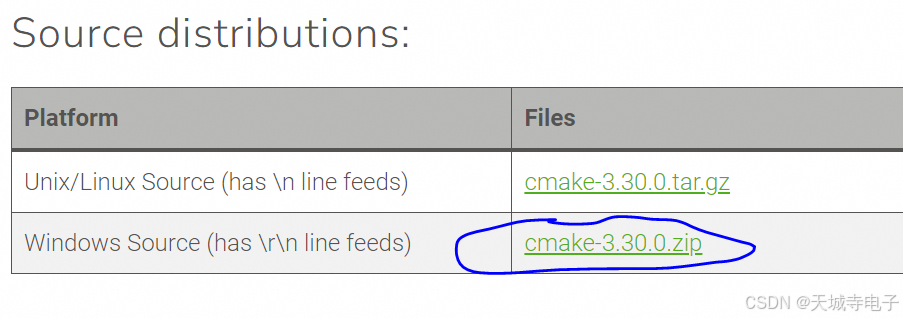

在命令行运行 cmake --version，有输出，即表示安装完成
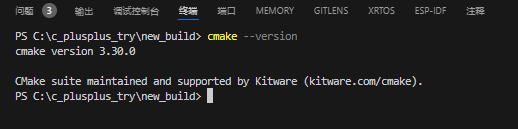

我们可以看到，cmake支持生成的配置工具文件有很多：包括ninja、make、VS等
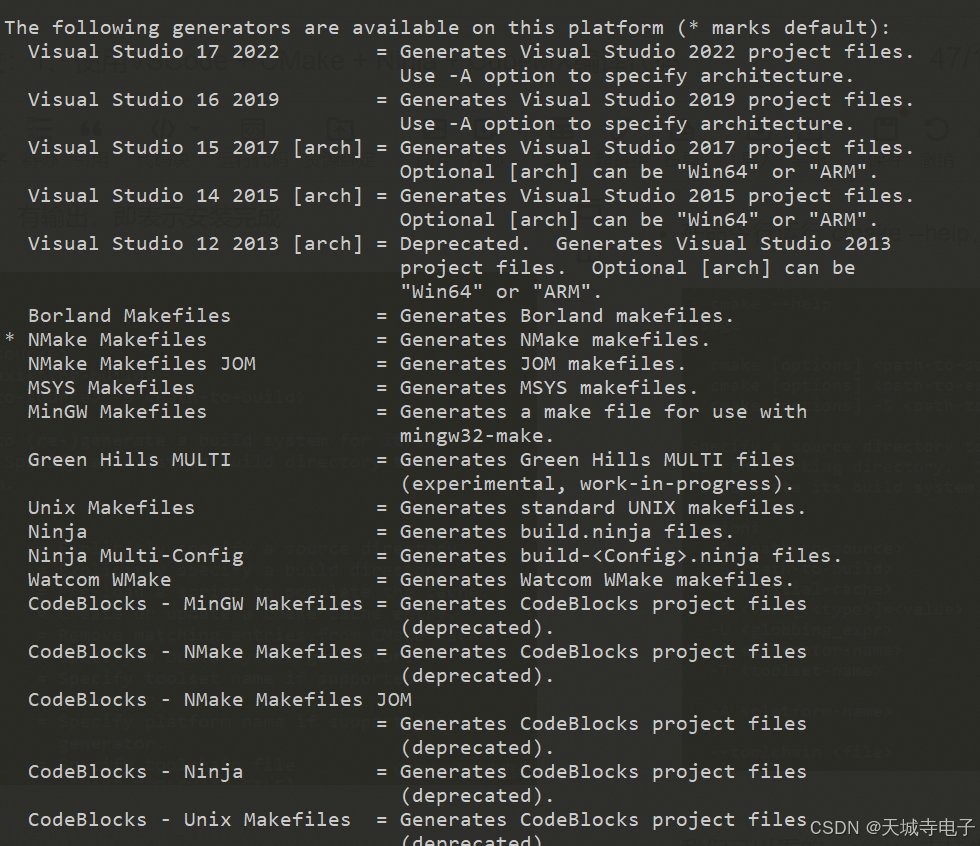
这里我们选择ninja，因为ninja是一个更加快速的构建工具，可以根据实际计算机性能调用多核编译，而且ninja的编译速度比make快很多

上面我们选择了CMake进行工程管理，CMake可以生成ninja的build.ninja配置文件，ninja按照该配置文件指导编译器进行依次编译即可。
首先我们下载ninja，官网：https://ninja-build.org/
下载链接：https://github.com/ninja-build/ninja/releases
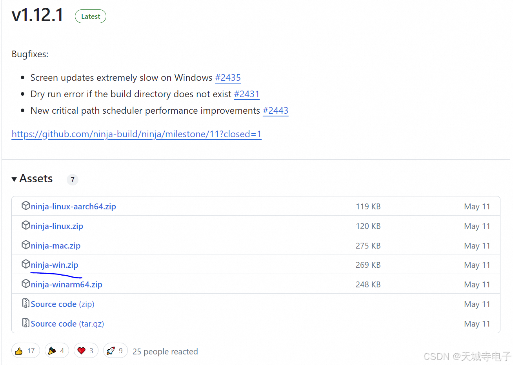
下载好后，解压，将目录添加到系统环境变量：
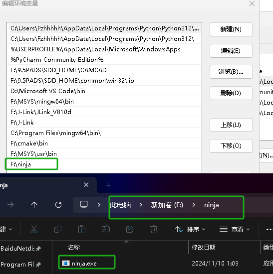
在终端中输入 
ninja --version 可以查看ninja是否成功安装且被系统识别
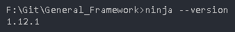
然后回到vscode，安装cmake和cmake-tools两个插件
然后进入cmake 扩展设置：
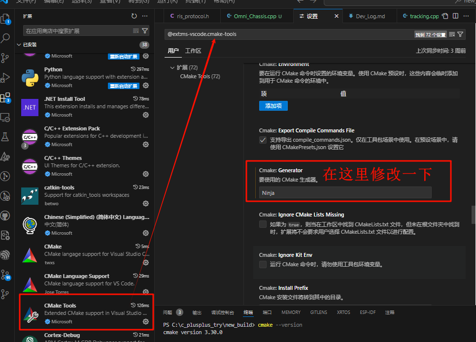
做好修改之后
ctrl+shift+p 
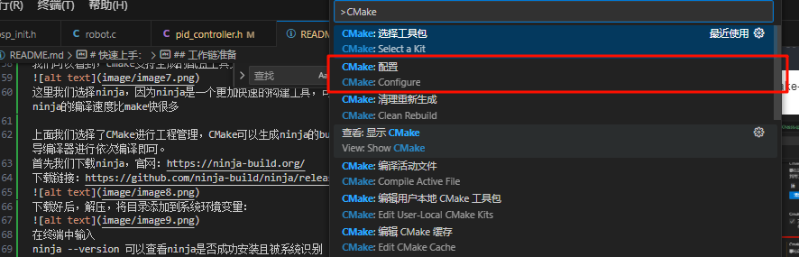
进行一波配置
输出中出现：
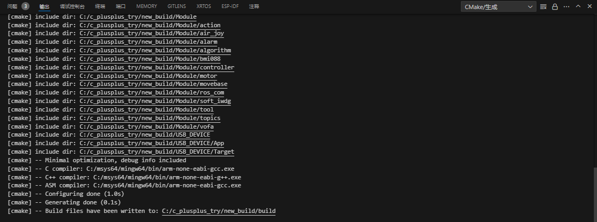
则cmake配置成功！
然后就是看我工作区下的.vscode/task.json中的东西


## vscode配置文件设置
- 可以直接抄.vscode 目录下的东西，也是看着修改，没啥好说的
- 首先明确：vscode的.json 文件分 工作空间下 和 全局空间 下（这就很符合程序员思维嘛）
一般来说，全局空间下的配置文件是不会随着工作空间的切换而改变的，而工作空间下的配置文件是会随着工作空间的切换而改变的；就跟你定义变量一样（
建议一些编译器路径相关的，根据你自己的电脑进行配置全局空间下的.json，不要和你的工程强绑定，否则别人会莫名其妙地报一堆错（
真正关于本工程的配置需要在工作空间下配置，如：头文件路径目录、Makefile文件路径、CMakeLists.txt文件路径、全局宏定义等等

- 先来看看 全局下的 setting.json
其实你仔细看一下，也可以发现这些其实就是你的vscode中的（扩展）插件配置，只不过是以.json文件的格式写出来了，当然你也可以直接`ctrl + ,` 打开你想要配置的扩展设置，然后用图形化界面进行修改
分点：

插件 cortex-debug 的配置,这个插件是用来调试的，但是我不推荐使用vscode调试，因为ozone更加强大
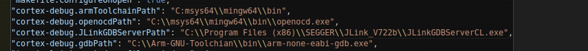
注意具体的工具链和调试器的配置路径换成你的电脑中的路径（在这之前一定要先将这些路径添加环境变量，然后在终端中输入xxx --version 看看会不会返回版本号来验证*（小坑：有时候要退掉所有vscode再重开这些环境变量才会真正被添加（注意是所有，不能只关一个当前的）*，然后再输入--version验证，有版本号返回就是成功））


- 使用CMake tools 时，默认的构建方式是MinGW Makefiles，而我的工程使用的是cmake + ninja 构建，所以在使用过ninja构建过后，使用CMake tools 配置时，会报错：
这只需要在这里修改一下就可以
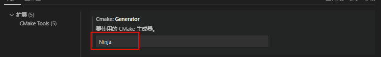 
- c_cpp_properties.json
*（笔者在好长一段时间内使用vscode开发没有任何代码提示、错误提醒时居然没有一点怀疑）*
只需要看着抄就可以了（可视化包括代码提示、错误提醒、代码补全等等）
**注意注意**：c_cpp_properties.json是c/c++插件为你的工作空间生成的配置文件，它能提供你在当前工作空间下的所有代码提示工作，但是这个文件是不会随着工作空间的切换而改变的，所以你需要在每个工作空间下都配置一遍，不然你会发现你的代码提示突然消失了，==即无全局配置==
这里提供了相对通用的stm32f407的配置，你可以根据自己的工程修改

**看下面提供的两个配置项：cmake和c_cpp可以联动，自动识别你的CMakeLists.txt中的自定义宏，然后为你提供未定义宏区域的暗化**
但是makefile不能，所以如果你想要实现这个效果，需要在下面的makefile配置中添加你的自定义宏定义

> *2024年10月30日更新：添加了Linux下的开发环境配置*

```json
        {
            "name": "arm-cmsis-c/cpp_use_cmake",// c_cpp插件会结合CMakeLists.txt的内容来给你提供可视化和代码提醒
            "includePath": [
                "${workspaceFolder}/**"
            ],
            // 保留核心宏定义
            "defines": [
                "_DEBUG",
                "UNICODE",
                "_UNICODE",
                "USE_HAL_DRIVER",
                "STM32F407xx",
                "ARM_MATH_CM4",
                "ARM_MATH_MATRIX_CHECK",
                "ARM_MATH_ROUNDING",
                "ARM_MATH_LOOPUNROLL",
                "DISABLEFLOAT16"
            ],
            "cStandard": "c17",
            "cppStandard": "c++17",
            "intelliSenseMode": "windows-gcc-arm",
            "configurationProvider": "ms-vscode.cmake-tools"// 核心：在这里和cmake tools联动，但是注意cmake tools 要先能成功识别你的CMakeLists.txt，这些可以自己找找教程，不难
        },
        {
            "name": "arm-cmsis-c/cpp_use_makefile",// c_cpp插件会结合Makefile的内容来给你提供可视化和代码提醒
            "includePath": [
                "${workspaceFolder}/**"
            ],
            // 核心宏定义+自定义宏定义
            "defines": [
                "_DEBUG",
                "UNICODE",
                "_UNICODE",
                "USE_HAL_DRIVER",
                "STM32F407xx",
                "ARM_MATH_CM4",
                "ARM_MATH_MATRIX_CHECK",
                "ARM_MATH_ROUNDING",
                "ARM_MATH_LOOPUNROLL",
                "DISABLEFLOAT16",
                "USE_RTOS_FOR_UART",
                "TOPICS_DEBUG",
                "DEBUG_FOR_ACTION",
                "CHASSIS_TO_DEBUG",
                "TEST_SYSTEM_TURNER",
                "TEST_SYSTEM_M2006",
                "TEST_SYSTEM_GM6020",
                "DISABLE_LOG_SYSTEM",
                "TEST_SYSTEM_M3508",
                "DISABLE_SYSVIEW_SYSTEM"
            ],
            "cStandard": "c17",
            "cppStandard": "c++17",
            "intelliSenseMode": "windows-gcc-arm",
            "configurationProvider": "ms-vscode.cmake-tools"
        }，
        {
            "name": "arm-cmsis-c/cpp_use_cmake_linux",
            "includePath": [
                "${workspaceFolder}/**"
            ],
            "defines": [
                "_DEBUG",
                "UNICODE",
                "_UNICODE",
                "USE_HAL_DRIVER",
                "STM32F407xx",
                "ARM_MATH_CM4",
                "ARM_MATH_MATRIX_CHECK",
                "ARM_MATH_ROUNDING",
                "ARM_MATH_LOOPUNROLL",
                "DISABLEFLOAT16"
            ],
            "cStandard": "c17",
            "cppStandard": "c++17",
            "intelliSenseMode": "linux-gcc-arm",
            "configurationProvider": "ms-vscode.cmake-tools"
        },
        {
            "name": "arm-cmsis-c/cpp_use_makefile_linux",
            "includePath": [
                "${workspaceFolder}/**"
            ],
            "defines": [
                "_DEBUG",
                "UNICODE",
                "_UNICODE",
                "USE_HAL_DRIVER",
                "STM32F407xx",
                "ARM_MATH_CM4",
                "ARM_MATH_MATRIX_CHECK",
                "ARM_MATH_ROUNDING",
                "ARM_MATH_LOOPUNROLL",
                "DISABLEFLOAT16",
                "USE_RTOS_FOR_UART",
                "TOPICS_DEBUG",
                "DEBUG_FOR_ACTION",
                "CHASSIS_TO_DEBUG",
                "TEST_SYSTEM_TURNER",
                "TEST_SYSTEM_M2006",
                "TEST_SYSTEM_GM6020",
                "DISABLE_LOG_SYSTEM",
                "TEST_SYSTEM_M3508",
                "DISABLE_SYSVIEW_SYSTEM"
            ],
            "cStandard": "c17",
            "cppStandard": "c++17",
            "intelliSenseMode": "linux-gcc-arm",
            "configurationProvider": "ms-vscode.makefile-tools"
        }


```
- tasks.json
这个配置文件是配置一些操作：即将你本来需要在终端中输入的一段段复杂的指令简化成一个个task，然后只要鼠标一点，就可以直接完成一系列操作：
（可能会有所误解，比如有人直接在终端中输入
```
cd build ; cmake -G \"Ninja\" .. ; ninja
```
发现编译failed！因为.json文件中""是表示键值的，所以说当我们的命令中同时也含有""时，就会和.json的语法冲突,这里的 \"其实是表示在键值中的""
下面的task中注意把路径该改的改了
> 最新修改：将clean的task修改了，因为用原有的commands会删不干净，所以采用最暴力的方式--删除目录，再新建一个
这个任务存在的必要性？--在提交东西到git上时，必须调用一次清除一下build的内容，这些都是编译产生的中间文件以及可执行文件，如果本地和远程都没清除就提交的话，很有可能两个可执行文件内容发生冲突，导致你不得不需要去修改二进制文件来解决冲突，那将非常麻烦
==所以务必clean一下再提交！！！==

请将下面中的clean任务修改为这个
```json
    {
        "label": "clean",
        "type": "shell",
        "command": "rm -r build ; mkdir build",
        "group": {
            "kind": "build",
            "isDefault": true
        },
    }
```


```json
{
    // See https://go.microsoft.com/fwlink/?LinkId=733558
    "version": "2.0.0",
    "tasks": [
        {
            "label": "build task",         // 任务标签
            "type": "shell",               // 任务类型,因为要调用mingw32-make,是在终端(CMD)里运行的,所以是shell任务
            "command": "mingw32-make -C ToolChain -j16",// 任务命令,线程数可以根据自己的电脑修改,建议与cpu核数相同，一般来说，建议将并行任务数设置为不超过逻辑处理器数的 1.5 倍到 2 倍
            "problemMatcher": [],        
            "group": {
                "kind": "build",
                "isDefault": true
            },
            "dependsOn": ["clean"] // 添加依赖项，每次构建都必须删除原build目录下的东西 
        },
        {
            /* 从dap调试器下载 */
            "label": "download dap",
            "type": "shell",
            /* 设定为在下载前编译 */
            "command":"mingw32-make -C ToolChain -j16 ; mingw32-make -C ToolChain download_dap", // "mingw32-make -j24 ; mingw32-make download_dap",
            /* 如果没有修改代码，编译任务不会消耗时间 */

            /* group字段
                用于将任务分组，并指定任务的类型和默认形态
                kind:"build" :将任务分组为测试任务
                isDefault:true :将任务设置为默认任务
             */
            "group": {
                "kind": "build",
                "isDefault": true
            },
            "problemMatcher": []
        },
        {
            /* 从jlink调试器下载 */
            "label": "download jlink", // 要使用此任务,需添加jlink的环境变量
            "type": "shell",
            "command":"mingw32-make -C ToolChain -j16 ; mingw32-make -C ToolChain download_jlink", // "mingw32-make -j24 ; mingw32-make download_jlink"
            "group": {
                "kind": "build",
                "isDefault": true,
            }
        },
        {
            /* 打开日志调试终端任务 */
            "label": "log",
            "type": "shell",
            /* 打开RTT终端命令 */
            "command":"JlinkRTTClient",
            "args": [],
            "problemMatcher": [],
            // 若使用daplink,则将log任务设置为依赖于jlink launch任务,保证jlink launch任务先于log任务执行
        },
        {
            /* 清除build目录下生成的可执行文件 */
            "label": "clean",
            "type": "shell",
            /* 使用MSYS2下bash终端，因为其支持Linux下的所有命令 */
            "command": "workspace_path=$(cygpath \"${workspaceFolder}\") && cd \"$workspace_path/build\" && rm -rf ./*",
            /* 添加options项，区分默认使用powershell终端，这样就可以直接打开MSYS2下的bash终端 */
            "options": {
                "shell": {
                    /* 添加你自己的MSYS2 bash终端安装路径，记得需要添加到环境变量中 */
                    "executable": "C:\\msys64\\usr\\bin\\bash.exe",
                    /* 传递给Bash的参数 -l：使 Bash 作为登录 shell 启动 -c:传递命令字符串给 Bash 执行 */
                    "args": ["-l", "-c"]
                }
            }
        },
        {
            /* 使用cmake构建项目，编译生成可执行文件 */
            "label": "build_by_cmake",
            "type": "shell",
            "command": "cd build ; cmake -G \"Ninja\" .. ; ninja",
            "dependsOn": ["clean"] // 添加依赖项，每次构建都必须删除原build目录下的东西 
        },
        {
            /* 使用cmake构建项目，编译生成可执行项目之后，烧录到单片机中 */
            "label": "download_jlink_after_cmake",
            "type": "shell",
            /* 暂时没有找到为什么不能通过ninja下载的原因 */
            "command": "mingw32-make -C ToolChain download_jlink",
            "dependsOn": ["build_by_cmake"]
        },
    ]

}

```
改完别急，这时你的终端默认打开还是window下的UNIX终端，而我的task中的指令默认是在类Linux的终端中执行的
所以需要修改task默认打开的终端
CTRL + shift + P
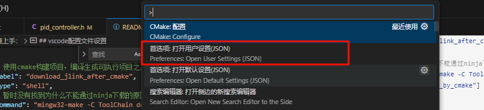
然后找到类似下面的部分，修改：
```json
"terminal.integrated.profiles.windows": {
     "bash (MSYS2)": {
       "path": "F:\\MSYS\\usr\\bin\\bash.exe",//这里改成你自己的bash目录
         "args": [
         "--login",
         "-i"
       ],
        "env": {
         "MSYSTEM": "MINGW64",
         "CHERE_INVOKING": "1",
         "MSYS2_PATH_TYPE": "inherit"
       }
     }
   },
   "terminal.integrated.env.windows": {
     "PATH":"${env:PATH};F:\\MSYS\\mingw64\\bin;path_to_gcc\\gcc-arm-none-eabi-10.3-2021.10\\bin"//这里也是改成你自己环境变量里的
   },
```
然后保存，退出，这时就可以使用任务来一键启动了
CTRL + shift + B
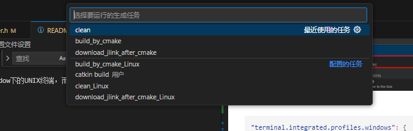
这里我编写了很多任务，分别支持windows/Linux下的cmake、makefile编译下载操作
下载程序需要用到JFlash，以及其下载文件：.jflash文件
这个文件如何获取呢？
找到我们之前安装的J-Flash
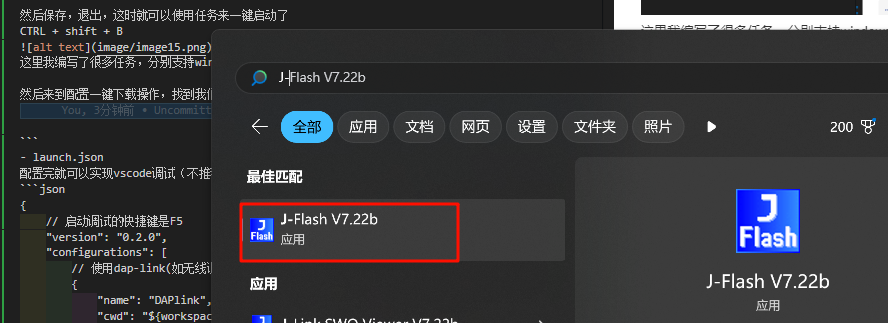
然后
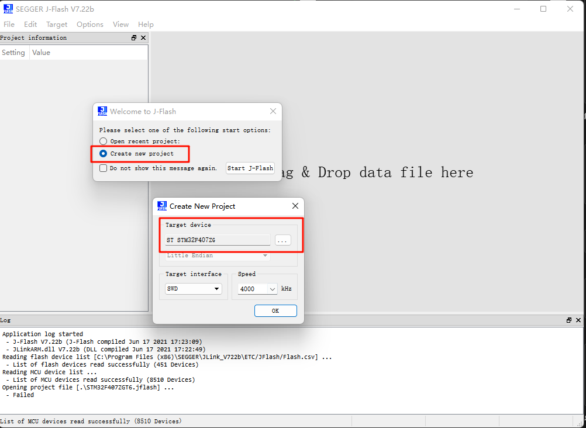
然后连接一下
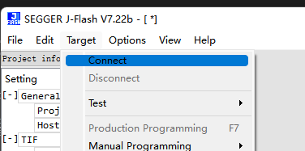
在下面的终端出现
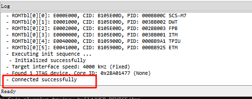
这步操作只需要做一次，然后保存.jflash文件到你的工程目录下指定位置（我是指定放在了ToolChain下）
接下来可以直接CTRL + shift + B
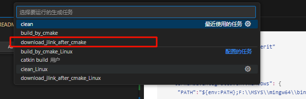
按理来说，就可以进行一键下载到开发板了


下面是在vscode配置调试的，没必要搞，直接用ozone就好
```
- launch.json 
配置完就可以实现vscode调试（不推荐使用vscode调试，还是使用ozone进行调试
```json
{
    // 启动调试的快捷键是F5
    "version": "0.2.0",
    "configurations": [
        // 使用dap-link(如无线调试器时的参考配置)
        {
            "name": "DAPlink",
            "cwd": "${workspaceRoot}",
            "executable": "${workspaceRoot}\\build\\new_build.elf", // 要下载到调试器的文件,花括号中的是vscode两个预定义的参数
            "request": "launch",
            "type": "cortex-debug",
            //使用J-link GDB Server时必须;其他GBD Server时可选（有可能帮助自动选择SVD文件）
            //支持的设备见 https://www.segger.com/downloads/supported-devices.php
            "device": "STM32F407ZG",
            //svd文件，有这个文件才能查看寄存器的值，每个单片机都不同。可以在以下地址找到 https://github.com/posborne/cmsis-svd
            //该项目的根目录已经提供了C型开发板使用的外设svd文件
            "svdFile": "STM32F407.svd",
            "servertype": "openocd", //使用的GDB Server
            "configFiles": [
                "openocd_dap.cfg", // 配置文件已经在根目录提供,若要修改以此类推,openocd的路径下的share/scripts中有各种写好的配置文件
            ],
            "runToEntryPoint": "main", // 调试时在main函数入口停下
            "showDevDebugOutput": "none", // 查看详细的调试输出
            "rtos": "FreeRTOS",
            "preLaunchTask": "build task",//先运行Build任务编译项目,取消注释即可使用
            "liveWatch": {
                "enabled": true,
                "samplesPerSecond": 4
            }
            // dap若要使用log,请使用Jlink调试任务启动,之后再打开log任务
            // 若想要在调试前编译并且打开log,可只使用log的prelaunch task并为log任务添加depends on依赖
        },
        // 使用j-link进行调试时的参考配置
        {
            "name": "Jlink",
            "cwd": "${workspaceFolder}",
            "executable": "${workspaceRoot}\\build\\new_build.elf",
            "request": "launch",
            "type": "cortex-debug",
            "device": "STM32F407ZG",
            "runToEntryPoint": "main",
            "showDevDebugOutput": "none",
            "servertype": "jlink",
            "interface": "swd",
            "svdFile": "STM32F407.svd",
            "rtos": "FreeRTOS",
            "preLaunchTask": "build task",//先运行Build任务,取消注释即可使用
            "liveWatch": {
                "enabled": true,
                "samplesPerSecond": 4
            },
            // "preLaunchTask": "log", // 调试时同时开启RTT viewer窗口,若daplink使用jlinkGDBserver启动,需要先开始调试再打开log
            // 若想要在调试前编译并且打开log,可只使用log的prelaunch task并为log任务添加depends on依赖
        },
        {
            "name": "DAP-attach",
            "cwd": "${workspaceRoot}",
            "executable": "${workspaceRoot}\\build\\new_build.elf", // 要下载到调试器的文件,花括号中的是vscode两个预定义的参数
            "request": "attach",
            "type": "cortex-debug",
            "device": "STM32F407ZG",
            "svdFile": "STM32F407.svd",
            "servertype": "openocd",
            "configFiles": [
                "openocd_dap.cfg",
            ],
        },
        {
            "name": "Jlink-attach",
            "cwd": "${workspaceFolder}",
            "executable": "${workspaceRoot}\\build\\new_build.elf",
            "request": "attach",
            "type": "cortex-debug",
            "device": "STM32F407ZG",
            "showDevDebugOutput": "none",
            "servertype": "jlink",
            "interface": "swd",
            "svdFile": "STM32F407.svd",
            "rtos": "FreeRTOS",
        },
    ],
}

## 项目开发的一些注意事项以及方法


